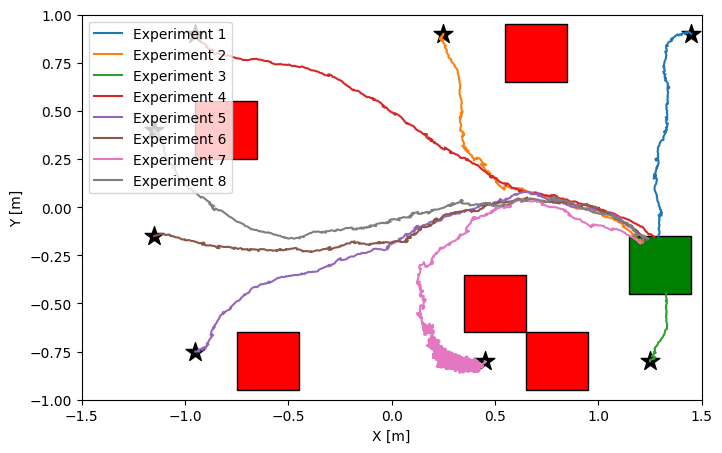

# Data-Driven Robot Navigation

  

## Context
This is a project work that I developed for the MSc Computer Engineering course on Data Driven Control Design at University of Salerno, Italy.

## Introduction
The aim of the project is to develop two data-driven algorithms for unicycle robots to navigate in uncertain environments. The robot is required to:\
(i) reach a desired destination; \
(ii) avoid obstacles.

In this context, we designed two algorithms that are crucial to enable autonomous navigation: \
(i) a forward data-driven control algorithm (FOC) to compute the optimal policy given the position of the robot and the obstacles;\
(ii) an inverse data-driven control algorithm (IOC) to estimate, from observations, the robot navigation cost. 

Moreover, we validated the results by leveraging a state-of-the-art robotics platform: the Robotarium by Georgia Tech. The platform offers both a high fidelity simulator and a remotely accessible experimental hardware facility. 

## Contents
- `ddc_project_work.ipynb`: Main Jupyter notebook file for the project work. It is organized in sections, each of which corresponds to a specific task of the project.
- `tools` folder: Contains a tool I developed to help me tuning the cost functions used in the FOC algorithm.
- `deployment` folder: Contains the source code for deployment of experiments the Robotarium platform.
- `img` folder: Contains some simulation images and plots referenced in the Jupyter notebook.

## Simulation on the Robotarium
The following video shows the simulation of the robot navigating in an uncertain environment using the proposed IOC algorithm. The robot is required to reach the desired destination and avoid obstacles. The cost is estimated from observations and used to compute the optimal policy.

  <video width="800" src="./videos/robotarium-poposed-ioc.mp4" />

## Requirements
Requirements are listed in the `requirements.txt` file.

## References
- [Forward Optimal Control](https://arxiv.org/abs/2306.13928)
- [Inverse Optimal Control](https://arxiv.org/abs/2306.13928)
- [Robotarium](https://www.robotarium.gatech.edu/)